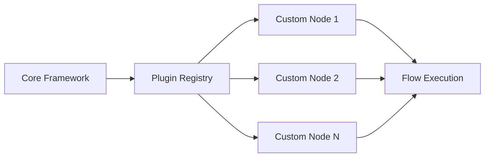
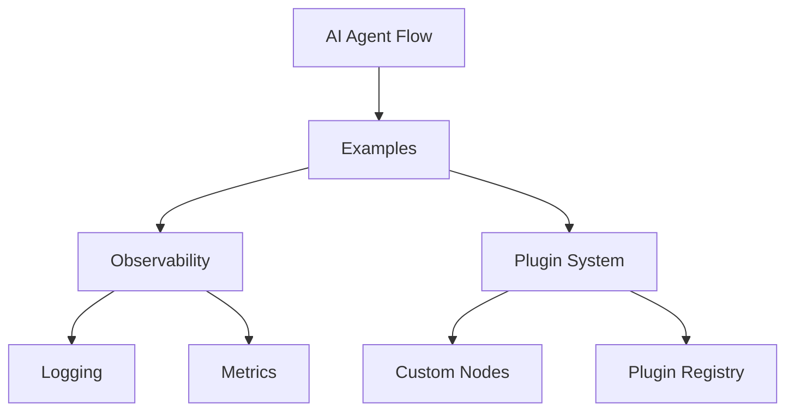

# AI Agent Flow Examples

This repository contains example implementations and usage patterns for the [AI Agent Flow](https://github.com/your-org/ai-agent-flow) framework. Each example demonstrates different features and capabilities of the framework.

## Examples

### Observability Example
Located in [`src/observability/`](src/observability/), this example demonstrates how to implement observability in your AI Agent Flow applications:

- Structured logging with `winston`
- Metrics collection with `prom-client`
- `/metrics` endpoint for Prometheus scraping

```mermaid
graph TD
    A[Flow Execution] --> B[Winston Logger]
    A --> C[Prometheus Metrics]
    B --> D[Structured Logs]
    C --> E[/metrics Endpoint]
    E --> F[Prometheus Server]
```

To run the observability example:
1. Install dependencies: `npm install`
2. Run: `npm start`
3. Access metrics at `http://localhost:3000/metrics`

### Plugin System Example
Located in [`src/plugin-system/`](src/plugin-system/), this example shows how to extend the AI Agent Flow framework with custom components:

- Custom node implementations
- Plugin registration and management
- Framework extension patterns



## Architecture Overview



## Setup
1. Install dependencies: `npm install`
2. Run: `npm start`
3. Test: `npm test`

## Scripts
- `npm start`: Run the code
- `npm run build`: Compile TypeScript
- `npm run lint`: Run ESLint
- `npm run test`: Run tests
- `npm run format`: Run Prettier

## Contributing
Feel free to contribute by:
1. Creating new examples
2. Improving existing examples
3. Adding documentation
4. Submitting bug reports

## License
This project is licensed under the MIT License - see the [LICENSE](LICENSE) file for details.