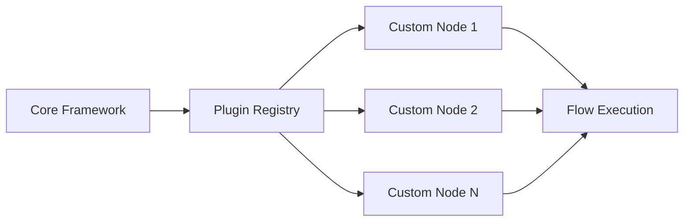
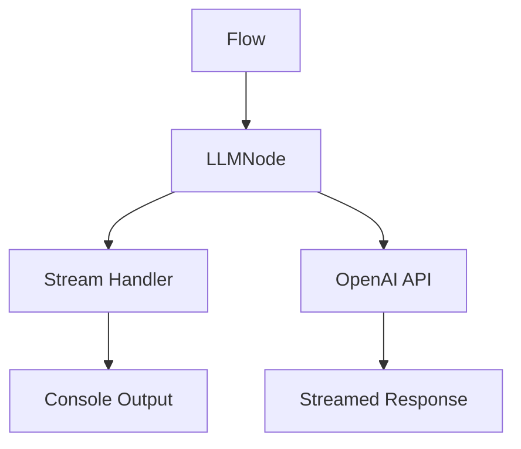
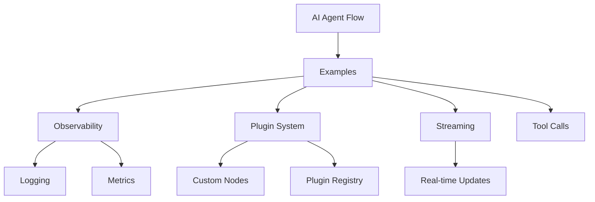

# AI Agent Flow Examples

This repository contains example implementations and usage patterns for the [AI Agent Flow](https://github.com/your-org/ai-agent-flow) framework. Each example demonstrates different features and capabilities of the framework.

## Examples

### Observability Example

Located in [`src/observability/`](src/observability/), this example demonstrates how to implement observability in your AI Agent Flow applications:

- Structured logging with `winston`
- Metrics collection with `prom-client`
- `/metrics` endpoint for Prometheus scraping

```mermaid
graph TD
    A[Flow Execution] --> B[Winston Logger]
    A --> C[Prometheus Metrics]
    B --> D[Structured Logs]
    C --> E[/metrics Endpoint]
    E --> F[Prometheus Server]
```

To run the observability example:

1. Install dependencies: `npm install`
2. Run: `npm start`
3. Access metrics at `http://localhost:3000/metrics`

`npm start` executes this observability example. Use `npx ts-node` for the
other examples.

### Plugin System Example

Located in [`src/plugin-system/`](src/plugin-system/), this example shows how to extend the AI Agent Flow framework with custom components:

- Custom node implementations
- Plugin registration and management
- Framework extension patterns



Run with:

```bash
npx ts-node src/plugin-system/index.ts
```

### Streaming Example

Located in [`src/streaming/`](src/streaming/), this example demonstrates how to handle streaming responses from OpenAI:

- Stream responses from OpenAI using LLMNode
- Handle partial updates with `.onUpdate()`
- Process streamed content in real-time



To run the streaming example:

1. Set up your OpenAI API key in `.env`
2. Run: `npx ts-node src/streaming/index.ts`


### Advanced Example

Located in [`src/advanced/`](src/advanced/), this example shows conditional branching with a `DecisionNode`.

Run with:

```bash
npx ts-node src/advanced/index.ts
```

### Chatbot Example

Located in [`src/chatbot/`](src/chatbot/), this is a tiny chatbot that tracks conversation history.

Run with:

```bash
npx ts-node src/chatbot/index.ts
```

### Data Pipeline Example

Located in [`src/data-pipeline/`](src/data-pipeline/), this example processes items in batches using `BatchNode`.

Run with:

```bash
npx ts-node src/data-pipeline/index.ts
```

### Debug UI Example

Located in [`src/debug-ui/`](src/debug-ui/), this example attaches an update handler for debugging flows.

Run with:

```bash
npx ts-node src/debug-ui/index.ts
```

### Express Server Example

Located in [`src/express-server/`](src/express-server/), this example exposes a flow via an Express endpoint.

Run with:

```bash
npx ts-node src/express-server/index.ts
```

### Memory Store Example

Located in [`src/memory-store/`](src/memory-store/), this example stores the flow context in memory between runs.

Run with:

```bash
npx ts-node src/memory-store/index.ts
```

### Multi-Agent Example

Located in [`src/multi-agent/`](src/multi-agent/), this example demonstrates agent communication via `MessageBus`.

Run with:

```bash
npx ts-node src/multi-agent/index.ts
```
### Tool Calls Example

Located in [`src/tool-calls/`](src/tool-calls/), this example demonstrates how to
invoke a custom tool within a flow.

Run with:

```bash
npx ts-node src/tool-calls/index.ts
```

## Architecture Overview



## Setup

1. Install dependencies: `npm install`
2. Run: `npm start` *(runs the observability example)*
3. Test: `npm test`

## Scripts

- `npm start`: Run the observability example
- `npm run build`: Compile TypeScript
- `npm run lint`: Run ESLint
- `npm run test`: Run tests
- `npm run format`: Run Prettier

## Contributing

Feel free to contribute by:

1. Creating new examples
2. Improving existing examples
3. Adding documentation
4. Submitting bug reports

## License

This project is licensed under the MIT License - see the [LICENSE](LICENSE) file for details.

