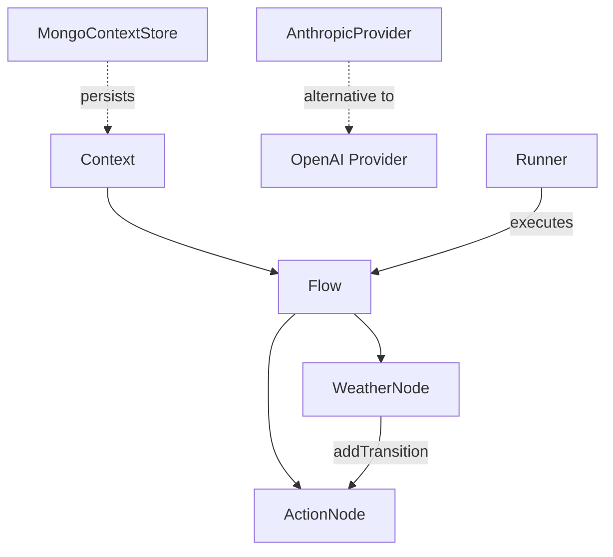

# 🔌 Plugin System Example

This example demonstrates how to extend the AI Agent Flow framework with custom components:

- ✅ Custom Node implementation (WeatherNode)
- 📦 Context storage with MongoDB
- 🤖 Alternative LLM provider (Anthropic)

## Run the Example

```bash
npm install
npx ts-node src/plugin-system/index.ts
```

## Architecture Overview



## Testing Instructions

1. **Basic Testing**:
   ```bash
   # Run the example with default settings
   npx ts-node src/plugin-system/index.ts
   ```
   You should see output showing the WeatherNode executing and the flow result.

2. **Running the Test Script**:
   ```bash
   # Run the dedicated test script
   npx ts-node src/plugin-system/test.ts
   ```
   This script provides a more focused test of the custom components with detailed output.

3. **Testing with MongoDB** (requires MongoDB installation):
   - Uncomment the MongoDB-related code in index.ts
   - Install MongoDB dependencies: `npm install mongodb`
   - Start a local MongoDB instance
   - Run the example again

4. **Testing with Anthropic** (requires API key):
   - Uncomment the Anthropic-related code in index.ts
   - Install Anthropic SDK: `npm install @anthropic-ai/sdk`
   - Replace 'your-anthropic-api-key' with your actual API key
   - Run the example again

5. **Customizing the Example**:
   - Modify the location in the context object to see different weather results
   - Add more nodes to the flow to test different combinations
   - Implement additional custom nodes following the WeatherNode pattern

## What You'll See

- A custom WeatherNode that simulates fetching weather data
- Integration with MongoDB for context persistence (commented out by default)
- Integration with Anthropic's Claude API (commented out by default)
- A simple flow that demonstrates how to use custom components

## Code Overview

The example implements three main plugin types:

1. **Custom Node**: WeatherNode extends the base Node class to provide weather information
2. **Context Store**: MongoContextStore for persisting flow context in MongoDB
3. **LLM Provider**: AnthropicProvider as an alternative to the default OpenAI provider

## Key Concepts

- **Node Extension**: Creating custom nodes by extending the base Node class
- **Context Persistence**: Storing and retrieving flow context from external databases
- **Provider Abstraction**: Implementing alternative LLM providers
- **Flow Composition**: Combining custom components with built-in nodes
- **Node Transitions**: Using `addTransition` to connect nodes in a flow

## Extending This Example

You can enhance this example by:
- Implementing more custom node types
- Adding authentication to the MongoDB connection
- Creating additional LLM providers (e.g., for local models)
- Building a plugin registry system for dynamic loading

## Dynamic Plugins

You can load plugins at runtime by passing their paths to the `Runner`
constructor. A plugin module exports an object with `name` and `setup`.

```javascript
// src/plugin-system/logger-plugin.js
module.exports = {
  default: {
    name: 'logger',
    setup(runner) {
      runner.onUpdate((u) => console.log('[PLUGIN]', u));
    },
  },
};
```

Load the plugin when creating a runner:

```typescript
import path from 'node:path';
import { Runner } from 'ai-agent-flow';

const runner = new Runner(3, 1000, undefined, [
  path.join(__dirname, 'logger-plugin.js'),
]);
```

## Dependencies

To use all features in this example, you'll need to install:

```bash
npm install mongodb @anthropic-ai/sdk
```

Note: The MongoDB and Anthropic integrations are commented out in the example by default to avoid requiring external services or API keys.

## Troubleshooting

- **TypeScript Errors**: If you encounter TypeScript errors, you may need to update type definitions or use type assertions as shown in the example.
- **Flow API Changes**: The Flow API may change between versions. Check the documentation for the correct method names.
- **MongoDB Connection**: Ensure MongoDB is running and accessible at the specified URI.
- **API Key Issues**: Verify your Anthropic API key is valid and has sufficient permissions.
- **Node Connections**: Use `flow.addTransition(fromNodeId, { action: 'default', to: toNodeId })` to connect nodes in a flow.
