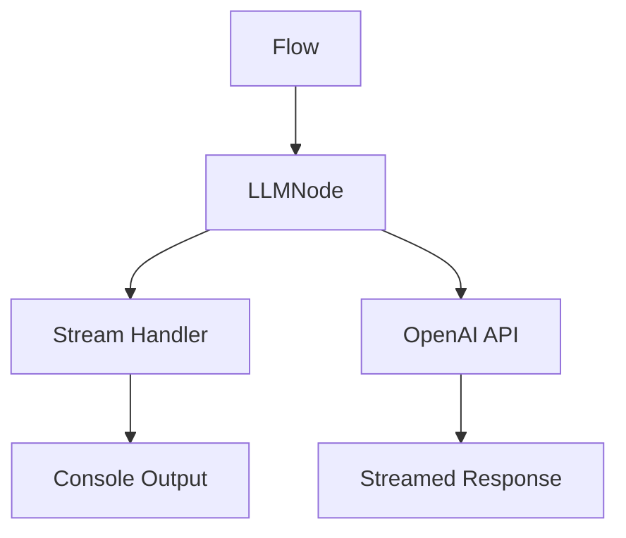

# Streaming Example

This example demonstrates how to use streaming responses from OpenAI using the AI Agent Flow framework. It shows how to:

- Configure an LLMNode with streaming enabled
- Handle partial updates using the `.onUpdate()` handler
- Process streamed content in real-time

## Updated Features

- **Real-time Streaming**: Stream responses from OpenAI in real-time.
- **Partial Updates**: Handle partial updates using the `.onUpdate()` handler.
- **Enhanced Flow Integration**: Seamlessly integrate streaming into AI workflows.

## Updated How to Run

1. Ensure your `.env` file contains the OpenAI API key:

   ```
   OPENAI_API_KEY=your-api-key-here
   ```

2. Install dependencies:

   ```bash
   npm install
   ```

3. Run the example:
   ```bash
   npx ts-node src/streaming/index.ts
   ```

## What to Expect

When you run this example, you'll see:

1. A prompt asking for a poem about AI
2. The response being streamed word by word in real-time
3. Each chunk of the response appearing as it's generated

## Updated Code Structure



## Updated Key Concepts

- **Streaming**: Receive responses in chunks instead of waiting for the complete response.
- **onUpdate Handler**: Process each chunk of the streamed response in real-time.
- **Real-time Processing**: Display content as it arrives.
